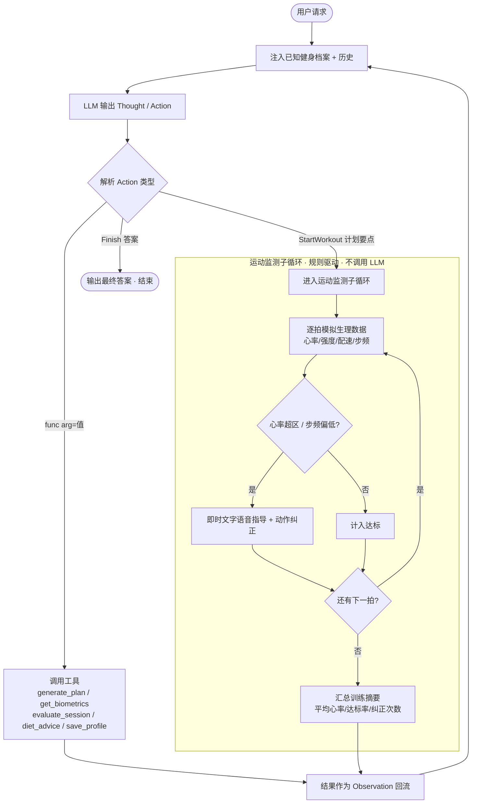
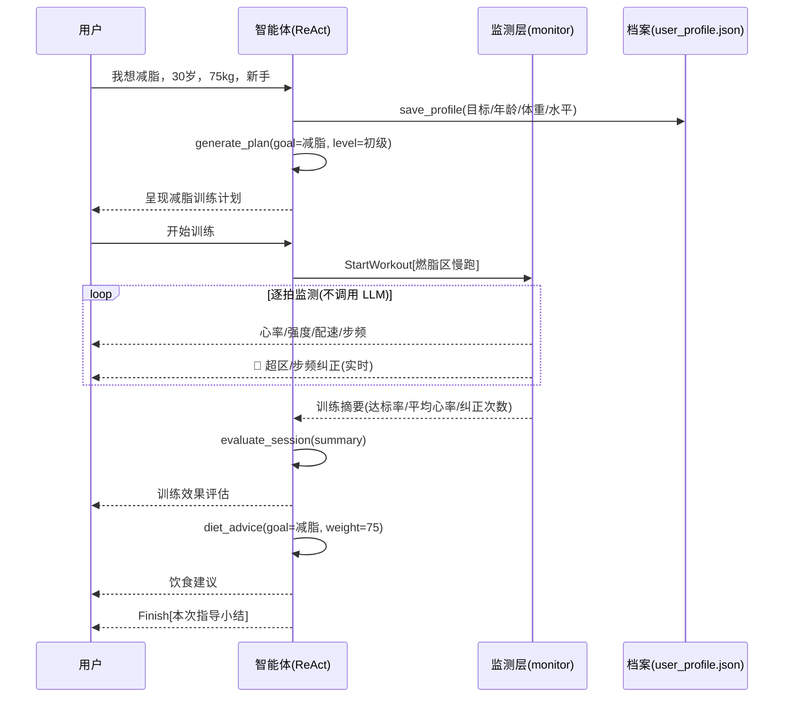

# 健身教练智能体 (fitness_agent)

一个基于大语言模型 + **ReAct（思考-行动-观察）** 范式的私人健身教练智能体。
它通过模拟可穿戴设备的数据流，完成"制定计划 → 运动监测 → 实时指导 → 效果评估
→ 饮食建议"的完整闭环，并跨会话记住你的健身档案。

## ✨ 核心能力

1. **生理数据监测** —— 模拟可穿戴设备，提供心率、运动强度、配速、步频的实时数据流，
   并按「最大心率 = 220 − 年龄」与健身目标自动计算目标心率区间。
2. **按目标动态调整训练计划** —— 支持「减脂 / 增肌 / 提升耐力」× 「初级 / 中级 / 高级」，
   并能根据当前心率/强度/恢复状态**动态调整**（心率≥150 追加呼吸恢复段、疲劳下调训练量）。
3. **运动中实时指导与动作纠正** —— 运动过程逐拍监测，心率越出目标区间或步频偏低时
   即时给出文字语音指导（规则驱动、不调用 LLM，保证实时）。
4. **训练效果评估 + 饮食建议** —— 按心率达标率给出效果评级与改进点，并按目标和体重
   给出热量方向、三餐结构与每日蛋白质参考量。
5. **跨会话记忆** —— 自动记住健身目标、年龄、体重、运动水平（本地 `user_profile.json`）。

## 🏗️ 项目结构

```
fitness_agent/
├── agent.py          # ReAct 主循环；解析/分派 Action，新增 StartWorkout 触发实时监测
├── llm_client.py     # OpenAI 兼容的 LLM 客户端
├── memory.py         # 健身档案持久化（user_profile.json，跨会话记忆）
├── prompts.py        # 健身教练系统提示词与工作流程引导
├── tools.py          # 工具集：计划生成 / 生理读数 / 效果评估 / 饮食建议 / 档案记忆
├── monitor.py        # 模拟可穿戴数据流 + 规则驱动的实时监测/纠正子循环
├── tests/            # 离线单元测试（不依赖 LLM）
├── requirements.txt  # 依赖
├── README.md         # 本文件
└── 需求文档.md        # 完整需求文档
```

## 🔧 环境要求

- Python 3.8+
- 一个 OpenAI 兼容的 LLM 服务及有效的 API Key

## 🚀 安装与运行

```bash
# 1. 安装依赖
pip install -r requirements.txt

# 2. 配置环境变量（BASE_URL 与 MODEL 有默认值，可按需覆盖）
export LLM_API_KEY=你的密钥
# 可选：
# export LLM_BASE_URL=https://api.openai.com/v1
# export LLM_MODEL=gpt-4o

# 3. 运行
python agent.py
```

> Windows 提示：程序入口已统一将终端输出切到 UTF-8，可正常显示 emoji 与中文。

## 🎬 演示模式（无需 API Key）

不想配置密钥也能完整看一遍流程——加 `--demo` 启动参数即可：

```bash
python agent.py --demo
```

演示模式使用内置的脚本化"假 LLM"，自动以"我想减脂，30岁，75kg，新手"为例，
依次走完：记录档案 → 生成计划 → 实时监测（含超区/步频纠正）→ **按实测峰值心率
动态调整计划** → 效果评估 → 饮食建议 → 收尾，无需任何网络调用。

## 💬 示例对话

```
请告诉我你的健身需求 > 我想减脂，今年30岁，体重75公斤，新手
```

智能体会依次：
1. 调用 `save_profile` 记录档案（目标=减脂、年龄=30、体重=75、水平=初级）；
2. 调用 `generate_plan` 生成减脂训练计划；
3. 用 `StartWorkout[...]` 进入实时监测——终端逐拍打印心率/强度/配速/步频，
   心率超出燃脂区或步频偏低时即时给出文字纠正；
4. 用 `evaluate_session` 按达标率评估本次训练效果；
5. 用 `diet_advice` 给出减脂饮食建议，最后 `Finish` 收尾。

下次启动时，开场会展示已记住的健身档案。

## ⚙️ 工作原理

每一轮，LLM 在系统提示与"已知健身档案"的引导下输出一对 `Thought / Action`，
主循环解析 `Action` 并分派为三类：

| Action 形式 | 含义 |
|-------------|------|
| `func(arg="值")` | 调用工具（如 `generate_plan(goal="减脂", level="初级")`） |
| `StartWorkout[计划要点]` | 进入运动监测子循环，结束后把训练摘要作为 Observation 回流 |
| `Finish[最终答案]` | 结束本次任务 |

工具/监测返回的结果作为 `Observation` 追加进历史，驱动下一轮思考，直到 `Finish`
或达到最大轮数。运动监测子循环全程不调用 LLM，确保实时反馈无网络延迟。

### ReAct 主循环与监测子循环的衔接



### 完整对话执行流程（示例）



## 🧪 测试

```bash
# 方式一：用 pytest（需先 pip install pytest）
pytest tests/ -q

# 方式二：单独验证运动监测子循环（无需 LLM、无需 pytest）
python monitor.py
```

测试覆盖：计划生成与动态调整、目标别名归一化、饮食建议、实时监测摘要、效果评估。

## 📌 约束与说明

- 可穿戴设备数据为 **Python 模拟生成**，未接入真实硬件 SDK。
- "实时语音指导"以 **文字播报** 形式呈现，未做真实 TTS 语音合成。
- 当前支持的健身目标限定为 **减脂 / 增肌 / 提升耐力** 三类。
- 本工具仅供健身指导参考，**不构成医疗建议**；特殊健康状况请遵医嘱。

## 🗺️ 后续可扩展方向

- 接入真实可穿戴设备 SDK（华为 / 苹果 / Garmin）替换模拟层；
- 接入真实 TTS 实现语音播报；
- 扩充健身目标与动作库级别的姿态纠正；
- 引入多次训练的趋势分析与周期化计划。

> 更完整的功能/非功能需求、验收标准见 [需求文档.md](需求文档.md)。
